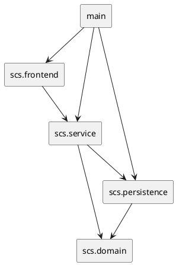

# 选课系统开发文档

## 1. 项目概述

学生选课系统使用 C++23、named modules、`import std;` 和 SQLite 开发。应用采用分层架构：

- `scs.domain`：包含 `Student`、`Teacher`、`Course` 等领域对象。
- `scs.persistence`：管理 SQLite 连接、schema 校验、查询和实时写入。
- `scs.service`：封装添加学生、添加课程、选课、成绩录入、统计和查询等业务用例。
- `scs.frontend`：负责菜单、输入校验提示和结果展示。

项目不再使用自有头文件或 txt 快照文件。标准库通过 C++23 named module `std` 导入。

所有 C++ 源码统一使用 `.cppm` 扩展名。模块接口使用 `export module`，模块实现单元使用 `module scs.*;`。`main.cppm` 和测试入口保持为导入模块的全局翻译单元，因为 C++ 入口函数 `main()` 不能附着到 named module。

## 2. 模块依赖



生产代码仅在 `scs.persistence` 的实现单元中通过全局模块片段引入 SQLite C API。测试夹具以相同方式私有引入该 C API。其余 C++ 文件统一使用 `import std;`。

## 3. SQLite 持久化

### 3.1 数据库路径

默认路径为：

```text
data/student_course_selection.db
```

程序接受首个命令行参数作为覆盖路径：

```sh
xmake run Student-course-selection-system -- custom/path/courses.db
```

应用启动时创建父目录、打开数据库、启用外键约束并验证 schema。启动失败时返回非零退出码。

### 3.2 Schema

当前 schema 版本为 `PRAGMA user_version = 1`：

```sql
CREATE TABLE students (
    id INTEGER PRIMARY KEY CHECK (id >= 0),
    name TEXT NOT NULL CHECK (length(trim(name)) > 0)
);

CREATE TABLE teachers (
    name TEXT PRIMARY KEY CHECK (length(trim(name)) > 0)
);

CREATE TABLE courses (
    id INTEGER PRIMARY KEY CHECK (id >= 0),
    name TEXT NOT NULL CHECK (length(trim(name)) > 0),
    description TEXT NOT NULL
);

CREATE TABLE enrollments (
    student_id INTEGER NOT NULL REFERENCES students(id) ON DELETE CASCADE,
    course_id INTEGER NOT NULL REFERENCES courses(id) ON DELETE CASCADE,
    score INTEGER CHECK (score BETWEEN 0 AND 100),
    PRIMARY KEY (student_id, course_id)
);
```

### 3.3 一致性策略

- `SqliteStorage` 使用 RAII 管理数据库句柄和 prepared statement。
- 动态值统一绑定到 prepared statement，不拼接 SQL。
- 新建 schema 使用事务。
- 服务层先校验业务条件，再写入 SQLite，成功后更新内存。
- 数据库写入失败时，内存状态保持不变。
- 应用启动时从数据库重建内存查询模型。

## 4. 服务层

`CourseSelectionService::create(storage)` 从 SQLite 加载初始状态。服务层继续使用：

- `std::expected<..., AppError>` 表达业务或数据库错误。
- `std::optional<int>` 表示未评分状态。
- `std::vector` 保存聚合对象。
- ID 关联学生和课程，避免共享所有权。

CLI 不再提供手动保存或加载菜单。每次业务修改均实时持久化。

## 5. 构建与工具链

```sh
xmake build
xmake run Student-course-selection-system
xmake build student_course_selection_tests
xmake run student_course_selection_tests
xmake install -o dist/install-check
```

xmake 使用 `c++latest`、`build.c++.modules` 和 `build.c++.modules.std`。SQLite 通过 `add_requires("sqlite3 3.53.0+0")` 获取并静态链接。

CI 固定验证以下工具链：

- Windows：MSVC 14.51 或更新版本。
- Linux：GCC 15.2。
- macOS：Homebrew GCC 15.2，不支持系统默认 AppleClang。

## 6. 测试覆盖

测试不依赖 `assert`，因此 debug 和 release 都会执行实际校验。覆盖范围包括：

- 学生、教师、课程新增及重复数据失败。
- 选课成功、重复选课、学生不存在、课程不存在。
- 成绩录入成功、未选课录入失败、成绩越界失败。
- 课程统计的选课人数、已评分人数、平均分、最高分和最低分。
- 首次建库、应用重启后恢复数据和实时写入。
- SQLite 外键约束、schema 版本不兼容和数据库路径错误。
- 数据库写入失败后内存状态保持不变。
