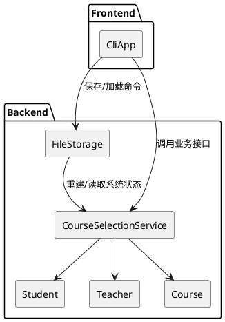
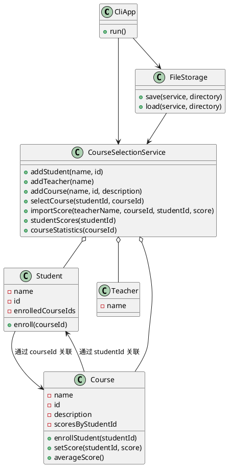
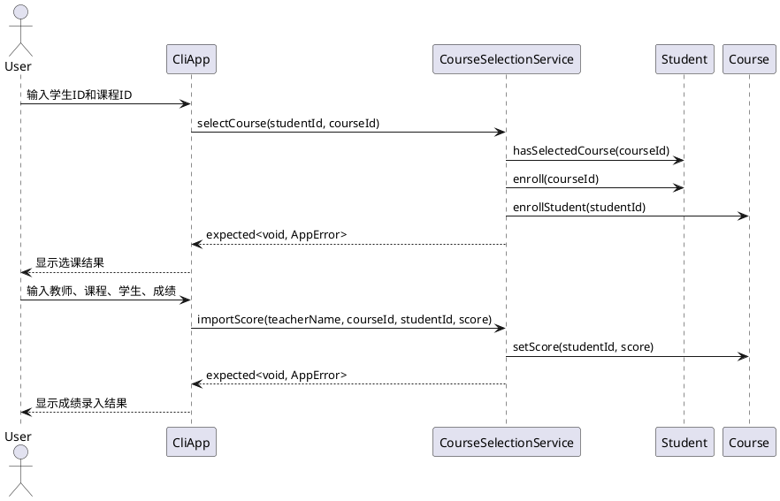

# 选课系统开发文档

## 1. 项目概述

学生选课系统使用 C++23 开发，采用分层架构：

- CLI 前端：负责菜单、输入校验提示和结果展示。
- 服务层：封装添加学生、添加课程、选课、成绩录入、统计和查询等业务用例。
- 领域层：包含 `Student`、`Teacher`、`Course` 等纯领域对象。
- 持久化层：负责将系统数据保存到文本文件，并从兼容旧格式的数据目录加载。

构建系统已从 CMake 迁移到 xmake，部署方式改为跨平台的 `xmake build`、`xmake run` 和 `xmake install -o <prefix>`。

## 2. 架构设计

### 2.1 组件图



### 2.2 类图



### 2.3 选课与成绩录入流程



## 3. 关键实现

### 3.1 所有权与引用关系

旧版本使用 `std::shared_ptr` 保存学生、教师和课程，并让菜单类直接访问实体私有字段。重构后：

- `CourseSelectionService` 用 `std::vector<Student>`、`std::vector<Teacher>`、`std::vector<Course>` 持有实体。
- 学生与课程之间只保存 ID，不保存对象指针。
- 成绩使用 `std::optional<int>` 表示“未评分”，避免 `-1` 这类哨兵值泄漏到业务接口。
- 查询接口返回只读引用包装或视图对象，不转移所有权。

### 3.2 错误处理

服务层统一返回 `std::expected<..., AppError>`。CLI 前端只负责把 `AppError` 转为中文提示，不参与业务判断。

### 3.3 持久化

`FileStorage` 继续读写旧数据文件名：

- `students.txt`：学生姓名、学生ID
- `teachers.txt`：教师姓名
- `courses.txt`：课程名称、课程ID、课程描述
- `student_courses.txt`：学生ID、课程ID
- `scores.txt`：课程ID、学生ID、成绩

路径通过 `std::filesystem::path` 处理，适配 Windows、Linux 和 macOS。

## 4. 构建、运行与安装

```sh
xmake build
xmake run Student-course-selection-system
xmake run student_course_selection_tests
xmake install -o dist/install-check
```

## 5. 测试覆盖

测试目标 `student_course_selection_tests` 使用标准库 `assert`，覆盖：

- 学生、教师、课程新增及重复数据失败。
- 选课成功、重复选课、学生不存在、课程不存在。
- 成绩录入成功、未选课录入失败、成绩越界失败。
- 课程统计的选课人数、已评分人数、平均分、最高分和最低分。
- 保存后重新加载，验证数据一致性。
